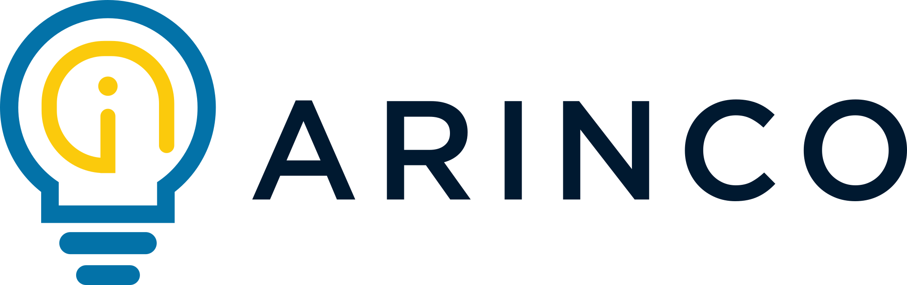

# 🇳🇿 Auckland .NET User Group

Welcome to the **Auckland .NET User Group** GitHub organization.

We are a community-driven user group focused on .NET, ASP.NET, and the wider technologies and practices around them. Our talks and events have also covered software architecture, cloud technologies, and other topics that help developers build modern applications.

## 🤝 Sponsors

<table>
  <tr>
    <td align="center" width="50%">
      
       
      <em>A Microsoft-partnered consultancy company</em>
    </td>
    <td align="center" width="50%">
      
    </td>
  </tr>
</table>

## 🔗 Useful Links

